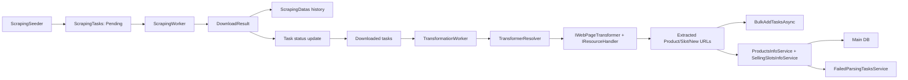

# Parsers Pipeline (Wave 1 Priority)

Связанные записи: [ADR-0001](./ADR/0001-documentation-system.md), backlog `DOC-005`, `DOC-014`, `DOC-016`.

## Контур

- Scraping выполняется `ScrapingWorker`.
- Transformation выполняется `TransformationWorker`.
- Storage:
  - очереди/история scraping — `ParsersDbContext` (`ScrapingTasks`, `ScrapingDatas`);
  - сохранение в основной каталог — через сервисы `Infrastructure` и `IProductsUnitOfWork`.

## E2E поток

## Фактические статусы по подсистемам

- `Scraping loop`: `Active`.
- `Transformation routing`: `Active`.
- `Failed parsing recovery`: `Experimental/WIP`.

## Наблюдаемые пробелы (зафиксировано как долг)

- Сигнатуры вызовов `CreateResolvationTask_*` в transformation и сервисе failure handling не полностью согласованы.
- В create-методах failure service создание сущностей не всегда заканчивается явным persist через repository.
- Не все типизированные ветки product update завершены (`NotImplementedException` в основном потоке).

## Операционный вывод

Для MVP pipeline пригоден как основа, но контур восстановления ошибок и типизированного update должен считаться нестабильным и быть под ручным контролем.
