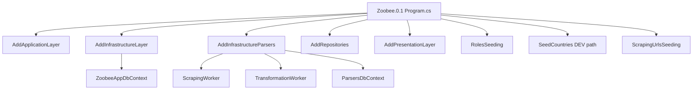

# Runtime Contour (Current Truth)

Связанные записи: [ADR-0001](./ADR/0001-documentation-system.md), backlog `DOC-004`, `DOC-013`.

## Канонический контур

Текущий runtime: **монолитный host `Zoobee.0.1` + in-host parser workers**.

## High-level схема

## Startup sequence (факт)

1. Инициализируется Serilog из `appsettings.json`.
2. Регистрируются слои приложения и парсеров через DI.
3. Поднимается middleware pipeline (`UseAuthentication`, `UseAuthorization`, `MapControllers`).
4. Выполняется `RolesSeeding`.
5. В `#if DEV` выполняется `SeedCountries` с абсолютного пути.
6. Выполняется `ScrapingUrlsSeeding` через `IScrapingSeeder`.
7. Стартуют hosted workers парсинга.

## Ограничения текущего контура

- Абсолютные пути в startup (`countries.json`, file sink logs).
- Startup зависит от наличия `Admin:Email`/`Admin:Password` в конфигурации.
- Build/restore в текущем окружении может падать с `0 ошибок` в выводе (см. риск-регистр).
